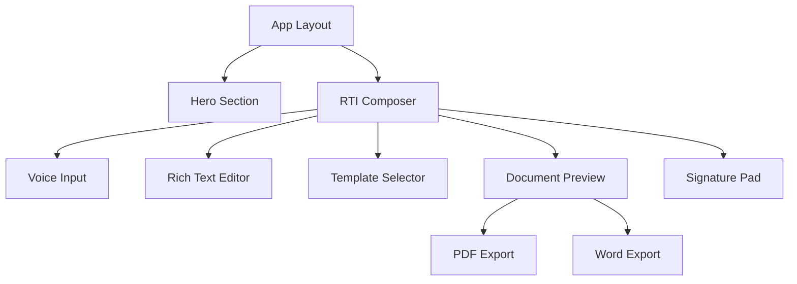

# 🏛️ RTI Platform

**Professional Right to Information (RTI) applications platform with AI assistance and voice input**

[](https://github.com/your-username/rti-platform)
[](https://opensource.org/licenses/MIT)
[](https://nextjs.org/)
[](https://www.typescriptlang.org/)

> Trusted by 10,000+ Indian citizens for transparent governance and efficient RTI application creation

## 📋 Table of Contents

- [🌟 Features](#-features)
- [🚀 Quick Start](#-quick-start)
- [🛠️ Installation](#️-installation)
- [⚙️ Configuration](#️-configuration)
- [📖 Usage](#-usage)
- [🏗️ Architecture](#️-architecture)
- [🎯 API Reference](#-api-reference)
- [🔧 Development](#-development)
- [📱 Deployment](#-deployment)
- [🤝 Contributing](#-contributing)
- [📄 License](#-license)
- [🆘 Support](#-support)

## 🌟 Features

### 🎯 Core Features
- **AI-Powered Assistance**: Intelligent content generation for RTI applications
- **Voice Input Support**: Speak naturally in multiple Indian languages
- **Real-time Document Preview**: Live preview with instant formatting
- **Multi-format Export**: PDF, Word, and print-ready documents
- **Legal Compliance**: RTI Act 2005 compliant formatting and structure
- **Digital Signatures**: Integrated signature pad for document authentication

### 🌐 Language Support
- **6+ Regional Languages**: Hindi, Bengali, Tamil, Telugu, Marathi, Gujarati
- **Voice Recognition**: Natural language processing in Indian languages
- **Smart Translation**: AI-powered content translation

### 📄 Document Features
- **Professional Templates**: Pre-built RTI templates for various departments
- **Smart Auto-fill**: Dynamic placeholder replacement with user data
- **Compliance Validation**: Real-time RTI Act 2005 compliance checking
- **Expert Templates**: 50+ department-specific templates

### 🔒 Security & Privacy
- **Secure Document Storage**: Encrypted document handling
- **Privacy First**: No data retention without explicit consent
- **Supabase Integration**: Secure authentication and data management

## 🚀 Quick Start

### Prerequisites
- Node.js 18+ 
- npm/yarn/bun package manager
- Supabase account (for authentication)

### 1-Minute Setup

```bash
# Clone the repository
git clone https://github.com/your-username/rti-platform.git
cd rti-platform

# Install dependencies
npm install

# Copy environment file
cp .env.example .env.local

# Add your Supabase credentials to .env.local
NEXT_PUBLIC_SUPABASE_URL=your_supabase_url
NEXT_PUBLIC_SUPABASE_ANON_KEY=your_supabase_anon_key

# Start development server
npm run dev
```

🎉 **That's it!** Open [http://localhost:3000](http://localhost:3000) and start creating RTI applications.

## 🛠️ Installation

### Using npm
```bash
npm install
```

### Using yarn
```bash
yarn install
```

### Using bun
```bash
bun install
```

### Development Dependencies
All required dependencies are listed in `package.json`. Key technologies include:
- **Next.js 15.2.4** - React framework
- **TypeScript 5.8.3** - Type safety
- **Tailwind CSS** - Styling
- **Supabase** - Backend services
- **Framer Motion** - Animations
- **Radix UI** - Accessible components

## ⚙️ Configuration

### Environment Variables

Create a `.env.local` file in the root directory:

```env
# Supabase Configuration
NEXT_PUBLIC_SUPABASE_URL=your_supabase_project_url
NEXT_PUBLIC_SUPABASE_ANON_KEY=your_supabase_anon_key

# Optional: Database Configuration
DATABASE_URL=your_postgres_database_url

# Optional: Authentication
NEXTAUTH_SECRET=your_nextauth_secret
NEXTAUTH_URL=http://localhost:3000
```

### Supabase Setup

1. **Create a Supabase Project**
   - Visit [supabase.com](https://supabase.com)
   - Create a new project
   - Note your project URL and anon key

2. **Database Schema**
   ```sql
   -- Users table (handled by Supabase Auth)
   -- RTI applications table
   CREATE TABLE rti_applications (
     id UUID DEFAULT gen_random_uuid() PRIMARY KEY,
     user_id UUID REFERENCES auth.users(id),
     title TEXT NOT NULL,
     content TEXT NOT NULL,
     department TEXT,
     status TEXT DEFAULT 'draft',
     created_at TIMESTAMP WITH TIME ZONE DEFAULT NOW()
   );
   ```

3. **Authentication Configuration**
   - Enable email authentication in Supabase dashboard
   - Configure OAuth providers if needed

### Customization

#### Branding
Edit `components/logo.tsx` and update:
- Logo images in `public/` directory
- Brand colors in `tailwind.config.js`
- Meta information in `app/layout.tsx`

#### Templates
Add custom RTI templates in:
- `lib/templates/` directory
- Update `components/expert-templates.tsx`

## 📖 Usage

### Creating an RTI Application

1. **Start Application**
   - Click "Start Application" on the homepage
   - Choose from expert templates or create custom

2. **Fill Application Details**
   - Use voice input or type manually
   - AI assists with content generation
   - Real-time compliance validation

3. **Review & Customize**
   - Live document preview
   - Edit content with rich text editor
   - Add digital signature

4. **Export & Submit**
   - Download as PDF or Word document
   - Print-ready formatting
   - Email ready for submission

### Voice Input

```javascript
// Voice input is automatically enabled
// Speak naturally and the AI will:
// 1. Convert speech to text
// 2. Structure the content professionally
// 3. Ensure RTI Act compliance
```

### API Usage

```javascript
import { exportToPDF, validateRTICompliance } from '@/lib/utils'

// Export application to PDF
await exportToPDF(content, 'my-rti-application.pdf', signature, userDetails)

// Validate RTI compliance
const validation = validateRTICompliance(applicationContent)
console.log(validation.isCompliant) // true/false
console.log(validation.score) // 0-100
```

## 🏗️ Architecture

### Project Structure
```
rti-platform/
├── app/                    # Next.js App Router
│   ├── api/               # API routes
│   ├── globals.css        # Global styles
│   ├── layout.tsx         # Root layout
│   └── page.tsx           # Homepage
├── components/            # React components
│   ├── ui/               # Reusable UI components
│   ├── hero-section.tsx  # Landing page hero
│   ├── rti-composer.tsx  # Main application composer
│   └── ...               # Other components
├── lib/                  # Utility functions
│   ├── cn.ts            # ClassName utility
│   ├── date-utils.ts    # Date formatting
│   ├── export-utils.ts  # PDF/Word export
│   ├── rti-utils.ts     # RTI-specific functions
│   └── utils.ts         # Re-exports
├── public/              # Static assets
├── types/               # TypeScript type definitions
└── styles/              # Additional stylesheets
```

### Component Architecture



### State Management
- **React State**: Local component state
- **Zustand**: Global state for user data and applications
- **Supabase**: Server state management

## 🎯 API Reference

### Core Functions

#### Document Export
```typescript
// Export to PDF
exportToPDF(
  content: string,
  filename?: string,
  signature?: string | null,
  userDetails?: UserDetails,
  place?: string
): Promise<void>

// Export to Word
exportToWord(
  content: string,
  filename?: string,
  signature?: string | null,
  userDetails?: UserDetails,
  place?: string
): Promise<void>
```

#### RTI Utilities
```typescript
// Format RTI content with user details
formatRTIContent(
  content: string,
  userDetails: UserDetails,
  signature?: string | null,
  place?: string
): string

// Validate RTI compliance
validateRTICompliance(content: string): {
  isCompliant: boolean;
  issues: string[];
  score: number;
}

// Get word count
getWordCount(text: string): number
```

#### Date Utilities
```typescript
// Format date for RTI documents
formatDate(dateString: string): string

// Get current date in Indian format
getCurrentDate(): string

// Format time duration
formatTime(seconds: number): string
```

### API Endpoints

#### Authentication
```http
POST /api/auth/signin
POST /api/auth/signout
GET  /api/auth/session
```

#### Applications
```http
GET    /api/applications      # List user's applications
POST   /api/applications      # Create new application
PUT    /api/applications/:id  # Update application
DELETE /api/applications/:id  # Delete application
```

#### Templates
```http
GET /api/templates           # Get all templates
GET /api/templates/:category # Get templates by category
```

## 🔧 Development

### Development Server
```bash
npm run dev     # Start development server
npm run build   # Build for production
npm run start   # Start production server
npm run lint    # Run ESLint
```

### Code Quality

#### Linting
```bash
npm run lint          # Check for linting errors
npm run lint:fix      # Auto-fix linting errors
```

#### Type Checking
```bash
npx tsc --noEmit     # Type check without compilation
```

#### Testing
```bash
npm run test         # Run tests (when implemented)
```

### Development Guidelines

#### Code Style
- Use TypeScript for all new code
- Follow ESLint configuration
- Use Prettier for code formatting
- Implement proper error handling

#### Component Development
```typescript
// Component template
interface ComponentProps {
  // Define prop types
}

export function Component({ prop }: ComponentProps) {
  // Component logic
  return (
    <div className="tailwind-classes">
      {/* Component JSX */}
    </div>
  )
}
```

#### Utility Functions
```typescript
// Add to appropriate utility file
export function utilityFunction(param: Type): ReturnType {
  // Function implementation
  return result
}
```

### Debugging

#### Common Issues
1. **Supabase Connection Issues**
   - Check environment variables
   - Verify Supabase project status
   - Check network connectivity

2. **Build Errors**
   - Clear `.next` directory
   - Reinstall node_modules
   - Check TypeScript errors

3. **Styling Issues**
   - Check Tailwind CSS compilation
   - Verify CSS imports
   - Clear browser cache

## 📱 Deployment

### Vercel (Recommended)

1. **Deploy to Vercel**
   ```bash
   npx vercel
   ```

2. **Environment Variables**
   - Add all `.env.local` variables to Vercel dashboard
   - Ensure Supabase URLs are production-ready

3. **Custom Domain**
   - Configure custom domain in Vercel
   - Update CORS settings in Supabase

### Other Platforms

#### Netlify
```bash
npm run build
# Deploy dist folder to Netlify
```

#### Docker
```dockerfile
FROM node:18-alpine
WORKDIR /app
COPY package*.json ./
RUN npm ci --only=production
COPY . .
RUN npm run build
EXPOSE 3000
CMD ["npm", "start"]
```

### Production Checklist
- [ ] Environment variables configured
- [ ] Supabase production setup
- [ ] Error monitoring enabled
- [ ] Analytics configured
- [ ] Performance optimized
- [ ] Security headers set
- [ ] SEO meta tags updated

## 🤝 Contributing

We welcome contributions from the community! Here's how you can help:

### Getting Started
1. Fork the repository
2. Create a feature branch
3. Make your changes
4. Write tests (if applicable)
5. Submit a pull request

### Development Setup
```bash
# Fork and clone the repo
git clone https://github.com/your-username/rti-platform.git
cd rti-platform

# Create feature branch
git checkout -b feature/your-feature-name

# Install dependencies
npm install

# Start development
npm run dev
```

### Contribution Guidelines
- Follow existing code style
- Write clear commit messages
- Update documentation as needed
- Test your changes thoroughly

### Types of Contributions
- 🐛 Bug fixes
- ✨ New features
- 📚 Documentation improvements
- 🎨 UI/UX enhancements
- 🌐 Translation support
- 🔧 Performance optimizations

## 📄 License

This project is licensed under the MIT License. See the [LICENSE](LICENSE) file for details.

```
MIT License

Copyright (c) 2024 RTI Platform Team

Permission is hereby granted, free of charge, to any person obtaining a copy
of this software and associated documentation files (the "Software"), to deal
in the Software without restriction, including without limitation the rights
to use, copy, modify, merge, publish, distribute, sublicense, and/or sell
copies of the Software, and to permit persons to whom the Software is
furnished to do so, subject to the following conditions:

The above copyright notice and this permission notice shall be included in all
copies or substantial portions of the Software.
```

## 🆘 Support

### Documentation
- [API Documentation](https://your-docs-site.com)
- [Video Tutorials](https://youtube.com/your-channel)
- [FAQ Section](https://your-site.com/faq)

### Community
- [GitHub Discussions](https://github.com/your-username/rti-platform/discussions)
- [Discord Server](https://discord.gg/your-server)
- [Twitter](https://twitter.com/your-handle)

### Professional Support
- Email: support@rti-platform.com
- Business Inquiries: business@rti-platform.com

### Reporting Issues
1. Check existing issues first
2. Use the issue template
3. Provide detailed reproduction steps
4. Include browser/OS information

---

## 🙏 Acknowledgments

- **Government of India** - For the Right to Information Act, 2005
- **Open Source Community** - For amazing tools and libraries
- **Contributors** - For making this platform better
- **Users** - For trusting us with their RTI applications

---

**Made with ❤️ for transparent governance in India**

*Get your RTI Application print-ready in minutes!*